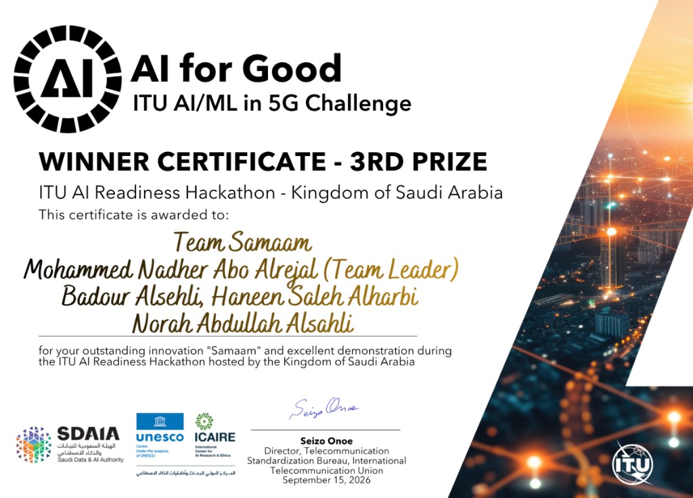

<div align="center">

# صِمَام · Samaam

**An AI-hardware policy gateway for oncology radiology.**
It sits between the technologist's console and the CT scanner, and returns
`403 Forbidden — Policy Violation` when the requested settings breach Saudi
regulation.

`ITU AI Readiness Hackathon — Kingdom of Saudi Arabia` · Health / Radiology track

[](LICENSE)


</div>

> ⚠️ **بيانات محاكاة لأغراض الهاكاثون فقط** — every patient record in this
> repository is synthetic. No real or realistic patient data exists here.

---

## Award — 3rd Prize (ITU AI Readiness Hackathon)

**Team Samaam** won **3rd Prize** at the
[ITU AI Readiness Hackathon — Kingdom of Saudi Arabia](https://aiforgood.itu.int/)
(AI for Good · ITU AI/ML in 5G Challenge), awarded **15 September 2026** by the
International Telecommunication Union for the innovation **Samaam**.

| | |
| :--- | :--- |
| **Team** | Team Samaam |
| **Leader** | Mohammed Nadher Abo Alrejal |
| **Members** | Badour Alsehli · Haneen Saleh Alharbi · Norah Abdullah Alsahli |
| **Hosts / partners** | ITU · SDAIA · UNESCO · ICAIRE |

<p align="center">
  
</p>

---

## The one-sentence version

A tired technologist enters a standard adult contrast protocol for a patient
whose kidneys are failing. Nothing between that keyboard and the scanner reads
the patient's renal function, and nothing checks the request against Saudi
regulation. **Samaam does both — before the exposure, and it does it in
deterministic code that no language model can talk out of a refusal.**

```http
POST /device/execute
→ 403 Forbidden — Policy Violation

  verdict  VIOLATION            action  AUTHORISE  (held for review, not prohibited)
  device   LOCKED               latency 29 ms

  ✗ national_drl        STATUTORY          CTDIvol 18.0 > 14.0 · DLP 900 > 706
                                           SFDA MDS-G008 · Royal Decree 60057
  ✗ renal_prophylaxis   NATIONAL_PROTOCOL  eGFR 19.1 < 30 · prophylaxis not ordered
                                           MoH Contrast Media Protocol, §5.2 p.22
  ✗ metformin           NATIONAL_PROTOCOL  Category II · not held
  ⚠ nephrotoxic_meds    NATIONAL_PROTOCOL  oxaliplatin, ibuprofen
```

**بالعربية —** بوابة تنظيمية تقف بين كونسول الأشعة وجهاز التصوير المقطعي. تقرأ
وظيفة الكلى عند المريض، وتقابل إعدادات التصوير على الأنظمة السعودية، وتمنع
التنفيذ برد `403` مع ذكر المادة والجهة المُصدِرة. القرار **كود حتمي**، لا نموذج
لغوي.

---

## Why this is not a chatbot

The claim of this project is safety, and a safety claim collapses the moment the
block is probabilistic. So the architecture separates the two jobs completely:

| | Node | Who does it | Can it block? |
| :--- | :--- | :--- | :--- |
| **The reasoning** | `M` | A language model, over retrieved policy text | **No** |
| **The decision** | `P` | Deterministic Python over cited thresholds | **Yes — only this** |

Delete the model entirely and Samaam still blocks correctly, every time. In the
demo the block lands in **29 ms**; the written explanation takes **~40 s**,
because that part *is* the model — and it arrives on a separate endpoint, after
the refusal has already been made.

---

## Architecture — ITU-T Y.3172, node for node

```
 SRC  ──▶  C  ──▶  PP  ──▶  M  ──▶  P  ──▶  D  ──▶  SINK
                            ▲       │
                            │       └─ VIOLATION ─▶ 403, device LOCKED
                    Knowledge Base
                     (ChromaDB)
```

| Node | In Samaam |
| :--- | :--- |
| **SRC** | Saudi regulation texts · synthetic patient record · technologist-entered scanner settings |
| **C** | Two real connectors: an HL7 FHIR R4 client (read-only) and a DICOM Modality Worklist C-FIND server the scanner queries |
| **PP** | PDPL anonymisation (direct identifiers dropped), chunking, local embedding |
| **M** | RAG retrieval + LLM drafting of the clinical/regulatory reasoning |
| **P** | **The Policy Node.** Deterministic guardrail: approve, hold, or block |
| **D** | Citations attached (authority · document · section · direct URL) + audit log written |
| **SINK** | Operator UI, and the mock device API that receives — or is denied — the execute command |

### The Policy Node

Six verdicts — `COMPLIANT` · `VIOLATION` · `AMBIGUITY` · `CONFLICT` ·
`POTENTIAL_GAP` · `INSUFFICIENT_EVIDENCE`.

Orthogonal to the verdict, and added after a consultant radiologist's review,
four **actions**: `PROCEED` · `CONFIRM` · `AUTHORISE` · `PROHIBITED`.

That separation is the clinical heart of the design. **No eGFR value forbids
iodinated contrast outright** — the MoH protocol makes stage 4–5 CKD a
*relative* contraindication and forbids withholding contrast from a
life-threatening indication on renal grounds. A system that hard-refuses at a
lab value replaces the physician, which is the single thing clinicians reject
most. So Samaam holds for a **named** authorisation instead, and logs the name.

Findings also carry their **basis** — `STATUTORY` (Royal Decree 60057) ·
`NATIONAL_PROTOCOL` (MoH) · `CLINICAL_GUIDANCE`. A statute and a protocol are
never presented as the same kind of thing.

---

## How it attaches to the scanner

No CT scanner exposes an API to be driven through. It **asks** — over DICOM, at
the start of a shift — for the work scheduled on it, and whoever answers that
question decides what appears on the technologist's screen.

```
Hospital system  ──FHIR──▶  ✋ Samaam  ◀──DICOM C-FIND──  CT scanner
   (creatinine)              (evaluates)                  (asks for its worklist)
```

So Samaam **is** the worklist server. Every entry is evaluated before it is
served: a blocked study is never returned, so it does not appear on the console
at all — and both outcomes are written to the audit trail against the querying
AE title. **The device is not modified, updated, or replaced.**

It is a live DICOM node, not a description of one:

```console
$ python -m pynetdicom echoscu <host> 11112 -aec SAMAAM
I: Received Echo Response (Status: 0x0000 - Success)

$ python -m pynetdicom findscu <host> 11112 -aec SAMAAM -W -k "(0010,0010)="
I: (0010,0020) LO [SC-01]                    # the compliant chest CT
I: Find SCP Result: 0x0000 (Success)         # SC-02 was withheld, and logged
```

**The honest limit:** this blocks the sanctioned path, it does not cut power. A
technologist retains manual, unscheduled entry — and that is correct, not a
weakness. **NEMA XR 25 (CT Dose Check)**, in every scanner since 2010, is itself
an alert requiring acknowledgement rather than a lock, because locking a scanner
on a critical patient can kill them.

The `/connectors` screen shows both connectors live, tests them on demand, and
pulls a patient from the FHIR server straight into the console.

---

## The three scenarios

Reproducible in one command: `python run_demo.py`

| # | Scenario | Verdict | Device |
| :--- | :--- | :--- | :--- |
| **SC-01** | Chest CT, eGFR 81.4, dose within national levels | `COMPLIANT` | **200** — released |
| **SC-02** | Abdomen/pelvis, **eGFR 19.1**, DLP 900, metformin not held | `VIOLATION` | **403** — withheld, overridable by a named consultant |
| **SC-03** | Bulk export of 4,200 oncology records abroad for marketing | `VIOLATION` | **403** — session terminated, **no override path** |

A fourth behaviour has no scenario file because it needs none: send an **empty
request** and the verdict is `INSUFFICIENT_EVIDENCE`. Samaam will not estimate a
renal function it was never given, nor invent a reference level where none is
published.

The difference between SC-02 and SC-03 is deliberate: **a clinician may accept
clinical risk for their own patient; none may authorise what the PDPL forbids.**
The same consultant name that releases SC-02 is refused on SC-03.

---

## Knowledge base

**45 records (43 verified) · 6 documented gaps · 1,338 chunks from 7 primary
documents.** Bilingual retrieval — an Arabic question returns the governing
Saudi record first.

| Authority | Document |
| :--- | :--- |
| Ministry of Health | [Protocols of Contrast Media (2021)](https://www.moh.gov.sa/en/Ministry/MediaCenter/Publications/Documents/Protocols-of-CM.pdf) |
| SFDA | [MDS-G008 — National Diagnostic Reference Levels](https://www.sfda.gov.sa/sites/default/files/2023-02/NDRL-En.pdf) |
| SDAIA | Personal Data Protection Law + Implementing Regulations |
| ITU-T | Y.3172 — architectural framework for ML in future networks |
| WHO | Ethics and Governance of AI for Health |

Every citation resolves to the **document itself**, never a ministry homepage.
Retrieval is semantic and runs on **local embeddings** (`multilingual-e5-small`
inside ChromaDB) — no key, no network, so the demo survives a dead venue wifi.

Two records exist that are `UNVERIFIED` or `HISTORICAL`. They are labelled as
such and **are never cited in a block.**

### The six gaps — found by absence, verified

Three independent deep-research passes plus direct retrieval of the primary
texts. Each gap is a provision searched for and **not found** — see
[`submission/TECHNICAL-REPORT.md`](submission/TECHNICAL-REPORT.md) for the full
matrix and the recommendations to the regulator.

The load-bearing one: **no Saudi provision allocates liability when a fatigued
technologist accepts an automated recommendation and harm follows.** Samaam does
not fix the law. It makes sure a name is on the decision.

---

## Run it

```bash
python -m venv .venv && .venv/bin/pip install -r requirements.txt
cp .env.example .env          # then paste your key into SAMAAM_LLM_API_KEY
.venv/bin/python -m app.ingest --reset
```

```bash
.venv/bin/python run_demo.py                          # all three scenarios, in the terminal
.venv/bin/uvicorn app.main:app --port 8000            # the API
cd web && npm install && npm run dev                  # the UI, on :5173
```

The LLM key is **optional**. Without it, retrieval and every block still work —
only the prose explanation goes missing, which is the point of the split.

**Deploying?** The service also serves the built frontend, so a single process
on a single port is the whole deployment — no CORS, no separate static host.
See [`DEPLOY.md`](DEPLOY.md).

### API

| | |
| :--- | :--- |
| `POST /device/execute` | Hand a worklist to the scanner. **403 when P refuses** |
| `POST /evaluate` | The full pipeline without touching the device |
| `POST /data/request` | The privacy path — hard block, no override |
| `POST /explain` | Prose for a decision already made. Deliberately separate |
| `GET /kb/search` · `/kb/record/{id}` · `/kb/gaps` | The corpus |
| `GET /connectors` · `POST /connectors/{id}/test` | The C node — live probes, not saved settings |
| `POST /connectors/fhir/pull` | Reads a patient and their latest creatinine over FHIR |
| `GET /audit` · `/framework` · `/scenarios` · `/health` | Trail, ITU dimensions, cases, status |

---

## ITU AI Readiness 2.0 — three dimensions, with evidence

| Dimension | Evidence in the running system |
| :--- | :--- |
| **D10 · AI & Policies** | Six verdicts, four deterministic rules, the gap matrix |
| **D11 · Data Governance & Privacy** | Identifiers dropped at PP; export blocked with no override path |
| **D13 · Human Collaboration & Oversight** | Conditional block, named consultant override, full audit trail |

Three of thirteen, deliberately. The framework asks for evidence, and padding
the list with dimensions we cannot demonstrate would weaken the three we can.

---

## Repository

```
app/          The gateway — policy_node.py is the heart, and has no model in it
web/          React 19 · TypeScript · Vite · Tailwind v4 · shadcn/ui
kb/           records/ (verified corpus) · sources/ (primary PDFs) · framework/ (ITU dimensions)
scenarios/    The three demo cases, plus the questions put to the reviewing clinician
submission/   Technical report (5 pages)
changelog/    Version history, every change
docs/         Concept, hackathon guide, knowledge base, research passes
```

| Deliverable | |
| :--- | :--- |
| Technical report | [`submission/TECHNICAL-REPORT.md`](submission/TECHNICAL-REPORT.md) |
| Demo video script | [`VIDEO-SCRIPT.md`](VIDEO-SCRIPT.md) |
| Change log | [`changelog/CHANGELOG.md`](changelog/CHANGELOG.md) |

---

## Ethics and safety

- **100% synthetic data.** Every screen and every document carries the notice.
- **Zero hallucination rule.** If retrieved context does not support a claim,
  the verdict is `INSUFFICIENT_EVIDENCE`. The Policy Node never invents a law
  name, an article number, or a URL.
- **No API keys in this repository**, at any commit. Secrets come from `.env`,
  which is gitignored.
- Samaam is a hackathon prototype. It is **not** a medical device, and nothing
  here is cleared for clinical use.

## License

[MIT](LICENSE) — Copyright © 2026 Team Samaam
(Mohammed Nadher Abo Alrejal · Badour Alsehli · Haneen Saleh Alharbi · Norah Abdullah Alsahli).

Open source does **not** mean public domain. The team retains copyright.
Registration with the Saudi Authority for Intellectual Property (SAIP) is
compatible with this license and strengthens formal evidence of authorship.
